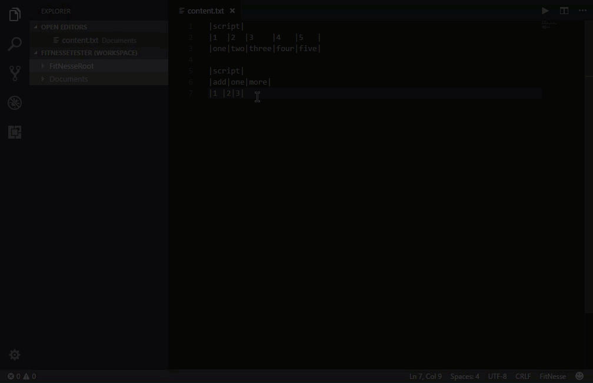

# VS Code FitNesse
     

A Visual Studio Code extension for your FitNesse tests.

## Contents
 * [Features](#Features)
 * [Configuration](#Configurations)
    * [Required](#Required-Configurations)
    * [Optional](#Optional-Configurations)
 * [Requirements](#Requirements)
 * [Known Issues](#Known-Issues)
 * [Demos](#Demos)
 * [Major Release Notes](#Major-Release-Notes)

## Features

 * Adds new language to VS Code
    * By adding the language, it ensures that the formatting only applies to content.txt files that get created with FitNesse
    * Allows for auto pairing on some of the FitNesse markup style's character formatting
 * Formatting FitNesse Tests
   * On save
   * Shift + Alt + F - Format Keybinding
   * Menu option for formatting a directory
   * Menu option for formatting a specific file
 * Running FitNesse Tests
   * Uses VS Code's integrated terminal to run the FitNesse test focused in the editor through command line
   * Most command line configurations for running tests - [Command Line Arguments](http://www.fitnesse.org/FitNesse.UserGuide.AdministeringFitNesse.CommandLineArguments)
   * Shift + Alt + T - Run Test Shortcut
   * Menu option for running a test in the R-Click menu when a test is open

## Configurations 
Outlined below are the configurations that have been added to run tests through VS Code's integrated terminal.

### Required Configurations
When running a test the '-c' and '-d' arguments are filled out by the extension based on what test you have open in the editor.

>// Java memory setting for running tests.\
  "fitnesse.javaVirtualMachineMemory": "768m"
>
>// Location of the FitNesse .jar for running tests.\
  "fitnesse.fitnesseJarLocation": "C:\\someLocation\\testing\\fitnesse\\fitnesse-standalone.jar"
>
>// Port to be used for running tests.\
  "fitnesse.fitnessePort": "8080"

### Optional Configurations
>
>// Java class path parameter for running FitNesse through the JVM.\
  "fitnesse.javaClassPath": null,
>
>// If argument is not present, FitNesse will not create access log files. If set creates access log files in specified directory.\
  "fitnesse.logDirectory": null
>
>// Set the system log level to verbose.\
  "fitnesse.logLevel": null
>
>// When a new version of FitNesse runs for the first time, it checks the existing environment to see if any new changes need to made to existing instance of FitNesse.\
  "fitnesse.omittingUpdates": null
>
>// Load an alternative configuration file. The format adhere's to the java standard of property files.\
  "fitnesse.plugins": null
>
>// Command test that will be ran after each test run, configurable for varying environments.\
  "fitnesse.postExecutionCommand": null
>
>// Command text that will be ran before each test run, configurable for varying enrivonments.\
  "fitnesse.preExecutionCommand": null
>
>// Redirect command output.\
  "fitnesse.redirectOutput": null
>
>// The directory in which FitNesse expects to find its page root. It defaults to the current directory ('.').\
  "fitnesse.rootPath": null
>
>// Sets the expiration date for page versions, any page version older than the number of days they are considered expired.\
  "fitnesse.versionsControllerDays": null
>
>// When determining the highest level of the path of the test this setting is used. The default is FrontPage as that is what Fitnesse expects.\
  "fitnesse.topPage":"FrontPage"

## Requirements

Be on the latest version of VS Code (utilizes workspaces). Also assumes that you have Java installed to run FitNesse, through the JVM. 

## Known Issues

> As of right now only works with context.txt files any other kind of test caching or file extensions do not work. I believe the latest version of FitNesse comes
> with a new .wiki extension. If you need to format the .wiki file extension please log an issue to the Github page. 

## Demos
### Format on Save

### Format from Menu

### Format Directory

## Major Release Notes
### 1.2.0
    * Added the ability to run tests that are currently open in the editor
    * Added shift + alt + t shortcut to run tests
    * Added menu option for running test if right clicking in open document area
    * Added configurations needed when running FitNesse

### 1.1.0

    * Added changes to README.md for better representation in marketplace
    * Added shift + alt + f key key binding for format of FitNesse files
    * Added menu option for formatting directories containing FitNesse files
    * Added menu option to format files from R-click in menu
    * Added Travis CI to validate master branch

### 1.0.0

    * Initial release of VS Code FitNesse.
    * Includes all main functional requirements outlined in the feature section. 
